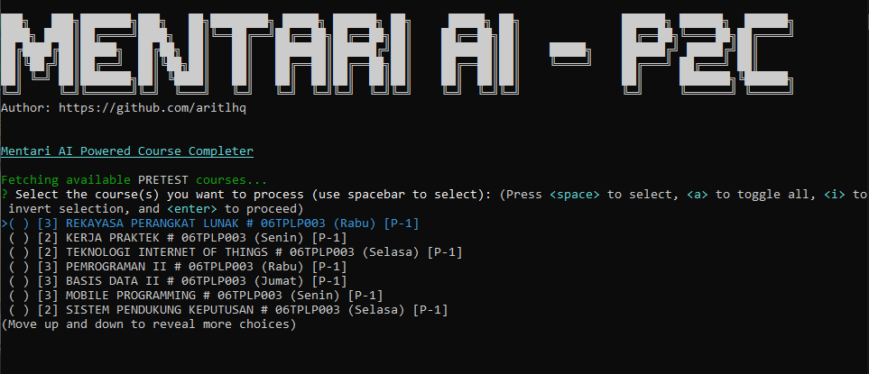
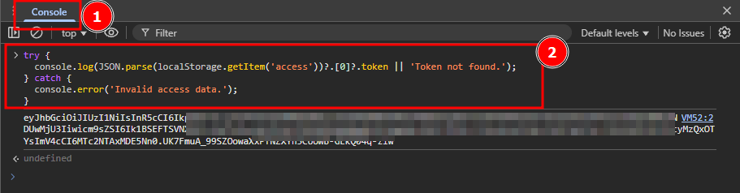
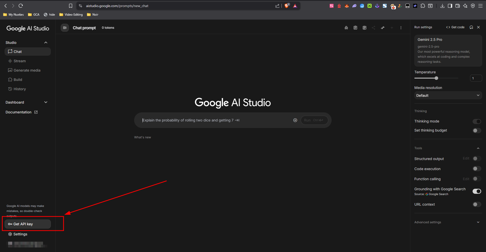
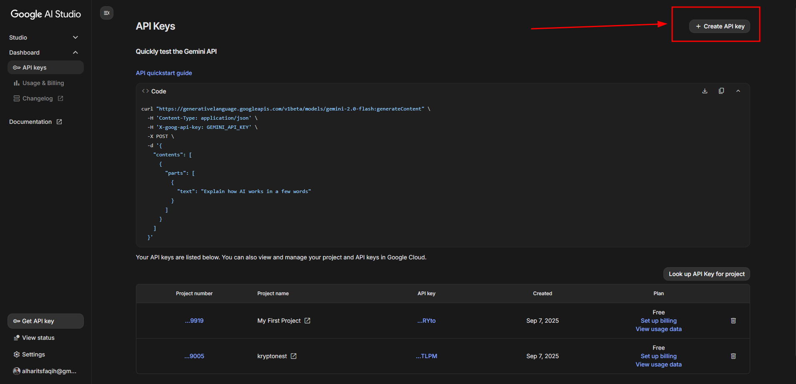
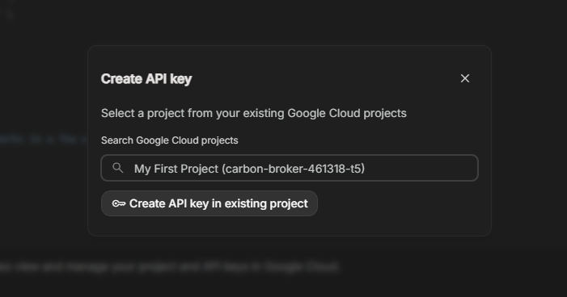
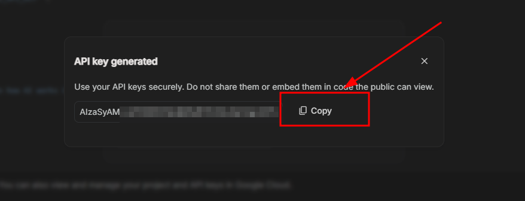

# Mentari AI-P2C (AI Powered Course Completer)

An AI-powered CLI tool to automate coursework on the Mentari academic platform.



## Features

- **Secure License System:** Authenticates with a remote server to ensure only authorized users can operate the tool.
- **AI-Powered Answers:** Integrates with Google's Gemini AI to provide intelligent, context-aware answers for quizzes.
- **Interactive Course Selection:** A clean interface to select one or more courses to process.
- **Standalone Executable:** Packaged into a single `.exe` file that runs on Windows without needing Node.js installed.
- **External Configuration:** Easily update your credentials by editing a simple `config.txt` file, no rebuilding
  required.
- **Real-Time Logging:** Colorful, easy-to-read logs show the bot's progress and actions as they happen.

## Tech Stack

- **Runtime:** Node.js
- **Language:** JavaScript (ES6 Modules)
- **CLI Interface:** Inquirer, Chalk
- **AI:** Google Gemini API
- **Authentication:** Custom License Server (Node.js, Express, Supabase)
- **Build Process:** esbuild, pkg, rcedit

## How to Use (For End-Users)

1. **Obtain a License Key:** This is a paid tool. To get a valid license key, please contact the author.

2. **Download:** After purchasing, you will receive a link to download the latest `mentari-ai-p2c.zip` file from
   the [Releases page](https://github.com/aritlhq/mentari-ai-p2c-public/releases).

3. **Extract:** Unzip the downloaded file into a new folder anywhere on your computer.

4. **Configure:** In the same folder, create a new text file named `config.txt`. Open it and paste the following,
   replacing the placeholders with your actual credentials:

   ```ini
   # Your unique license key provided upon purchase
   LICENSE_KEY=your-unique-license-key-here

   # Your personal bearer token from the Mentari platform
   MENTARI_TOKEN=your_long_bearer_token_from_the_mentari_platform

   # Your personal Google Gemini API key
   GEMINI_API_KEY=your_google_gemini_api_key
   ```

5. **Run:** Double-click the `mentari-ai-p2c.exe` file. The application will first validate your license key online and
   then start.

## How to Get Mentari Token

1. Open Mentari website and login to your account.
2. Open Inspect Element (Right click > Inspect).
3. Copy this code.

```
try {
  console.log(JSON.parse(localStorage.getItem('access'))?.[0]?.token || 'Token not found.');
} catch {
  console.error('Invalid access data.');
}
```

4. Paste into Console.
5. Click Enter.
   
6. Now, you have obtained your bearer token (`eyJhbGciOiJIUzI1NiIsInR5cCI6Ik...`).
7. Paste it into `config.txt`. Set it as the value of the `MENTARI_TOKEN` variable.

## How to Get Gemini Token

1. Go to https://aistudio.google.com/prompts/new_chat
2. Click `Get API Key`.
   
3. Click `Create API Key`.
   
4. Select a project from your existing Google Cloud projects.
   
5. Click `Create API Key in existing project`.
6. Your API Key successfuly generated.
   
7. Copy and paste into `config.txt`
